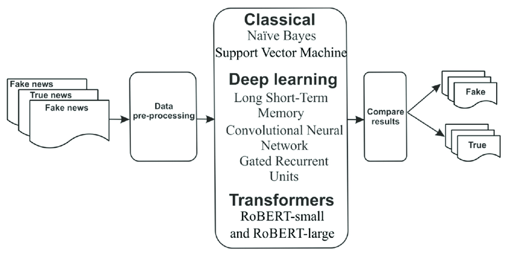

# Fake News Detection - DMTA 2023/2024

Fake News Detection project for Data Mining and Text Analytics unit

*Image from [this paper](https://arxiv.org/abs/1408.5882).*

## Introduction
Welcome to the Fake News Detection project! In today's digital age, the spread of misinformation is a significant concern. This project leverages the power of Neural Networks to tackle the issue of fake news by analyzing news headlines and classifying them as either real or fake.

**Note:** Initially, we experimented with the Multinomial Naive Bayes (MultinomialNB) model, and the classifications appeared to be correct. However, seeking to explore the potential of Neural Networks, we decided to construct a custom model with the assistance of ChatGPT. Our aim is to compare the results of the Neural Network with the initial MultinomialNB model.

## Description

The project aims to create a model capable of distinguishing between true and false news, thereby contributing to mitigating the spread of misleading information.

## Key Features

- Text analysis to identify common traits of fake news.
- Utilization of machine learning algorithms for news classification.

## System Requirements

- Python 3
- Machine learning libraries such as pandas, numpy, sklearn and tensorflow.
- Other specific requirements for your development environment.

## Installation

## Usage

To use the fake news detection project, follow the steps below:

## License

This project is distributed under the MIT License. Read the LICENSE.md file for further details.

## Contact

- Gabriel Geraci, Lorenzo Fratini
- {gabriel.geraci1, lorenzo.fratini1}@studenti.iulm.it
- Linkedin profiles link

## Project Status

Currently, the project is in active development. Check the repository issues for the latest challenges and planned improvements.

## Acknowledgments

# Acknowledgements

We would like to acknowledge and express our gratitude to the following articles and websites that have greatly contributed to the development and inspiration of this fake news detection project:

- [Automatic Fake News Detection for Romanian Online News.](https://www.researchgate.net/publication/359252597_Automatic_Fake_News_Detection_for_Romanian_Online_News): Brief description of how this article influenced the project.
- [Article Title 2](https://arxiv.org/ftp/arxiv/papers/2201/2201.07489.pdf): Brief description of how this article inspired certain aspects of the project.
- [Website Name](URL3): Description of the valuable resources or insights obtained from this website.
- ...

These sources played a significant role in shaping our understanding and approach to fake news detection.

## Troubleshooting

Report bugs or issues by opening a new GitHub issue.

